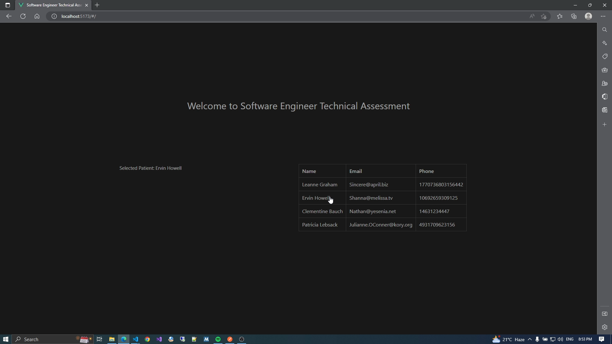

# Software Engineer Technical Assessment

- [Software Engineer Technical Assessment](#software-engineer-technical-assessment)
  - [Introduction](#introduction)
  - [Tutorial Links](#tutorial-links)
  - [Issues](#issues)
  - [Project Setup](#project-setup)
  - [Task Description](#task-description)
    - [Background](#background)
    - [First Task](#first-task)
    - [Second Task](#second-task)

## Introduction

Welcome to the Technical Assessment Test. In this test, you will be given some requirements that will have to be implemented. You will be working on a sandbox project with specific scenerio that matches the tasks assigned. Please be aware that this codebase contains very minimalistic features and does not intend to overwhelm with unncessary complexity. The main purpose of a pre-given codebase is to provide a reference on the best practices followed in Vue.js. Although we are not expecting any candiate to have any prior experience in a very specific framework, having good analytical skill, being comfortable in understanding legacy codebase and ability to comprehend requirements clearly are must while working in a professional environment. That is why, we are providing you with the codebase and your task is to understand the codebase and implement the requirements inside it by maintaining the best practices followed here.

## Tutorial Links

1. [Vue js](https://vuejs.org/)
2. [Vuex](https://vuex.vuejs.org/)
3. [jQuery](https://api.jquery.com/)
4. [Vue for React Devs: Differences](https://www.vuemastery.com/courses/vue-for-react-devs-differences/reacting-to-changes/)

## Issues

For any question, please open an issue or email at [support@tajirhasnain.com](mailto:support@tajirhasnain.com)

## Project Setup

Fork the repository and clone the forked repository to work on.

After cloning the repository, replace the proxy target in `vite.config.ts` with the given API url in the email.

Install dependencies

```sh
npm install
```

Compile and Hot-Reload for Development

```sh
npm run dev
```

Type-Check, Compile and Minify for Production

```sh
npm run build
```

Run Unit Tests with [Vitest](https://vitest.dev/)

```sh
npm run test:unit
```

Run End-to-End Tests with [Cypress](https://www.cypress.io/)

```sh
npm run test:e2e:dev
```

This runs the end-to-end tests against the Vite development server.
It is much faster than the production build.

But it's still recommended to test the production build with `test:e2e` before deploying (e.g. in CI environments):

```sh
npm run build
npm run test:e2e
```

Lint with [ESLint](https://eslint.org/)

```sh
npm run lint
```

## Task Description

### Background

Your company has decided to migrate its old codebase to a new tech stack. Previously, they used vanilla JavaScript since the older codebase ages back before even [Node.js](https://nodejs.org/) was a thing. But the problem is, migrations are not that easy to accomplish. In an ideal world, you would expect to migrate the whole project to the new stack and then use it. But, since your company is already in production, they cannot afford it. They need to introduce simple changes at a time to adapt the new product in the market. So, you are currently in that phase of migration where the new codebase is gradually getting updated, but it still supports older codebase features in some cases.

### First Task

Your product manager has given the developer team a new requirement to introduce the authentication system in the new codebase. Your senior engineer has given you the necessary API for implementing the authentication in the frontend.
The authentication system requires the website to have:

- Sign up page for the new user
- New user needs to verify their email before accessing other APIs to get data
- Login page
- Redirect to homepage if already logged in.
- Redirect to login page _i.e_ cannot access any other page other than Login and Sign up page if user is not authorized.

So, for implementing this feature, You will need to do the following:

- Introduce a new Sign up page and create a new user on successful sign up.
- Introduce a new login page and authorize user.
- Introduce a navigation guard in the router so that user is not able to access authorized pages without login _i.e._ he will be redirected to login page if unauthorized.

### Second Task

There are two vanilla webpages in the old codebase that needs to be introduced in the new codebase. One is the patients list page (`Old Codebase/patients/index.html`) and another is the banner (`Old Codebase/banner/index.html`). You need to directly add these webpages as `iframe` in the current project. Due to configuration issues, you cannot re-implement the pages in vue from scratch.
In the older codebase, how those two webpages communicated was, whenever you double click any row of the patients list table, the banner would update the 'Selected Patient' with the selected patient from `patients/index.html` page. You need to introduce this functionality in the current codebase.

For implementing this feature, you will need to do the following:

- Remove the sample component from the Home view.
- Add both of the webpages (`patients/index.html` and `banner/index.html`) as `iframe` in the Home view.
- Populate the patients table with patient information from the database. (Currently, it gets populated with static dummy data). Note that, you need to make API call inside Vue framework, the iFrame should then be able to access the patients list from the vue component. Do not introduce any API call inside the iframes. See how devices list is being fetched. You will have to fetch the patients list in the same way to maintain consistency in the codebase. After the fetch is complete, the iframe should be able to access that patients list and populate the table.
- On double clicking any row, update the banner. (`banner/index.html`)

Expected result should be like following video:

[](./requirements/task-2.mkv)

Here, both the patients table (on right) and the banner (on left) are launched inside iframes.
